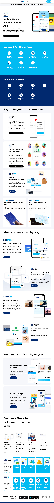

# Product Homepage

## 🚀 About Me
Hi, I'm `Yash Kumar`, a web developer living in Delhi, India.

 

## About this project🧑‍💻
 - This project is basically clone of paytm website using tailwind css.
 - It took me around `10 hrs` to complete this project.
  

## Below are the take aways from this project:📖
 - I got to know how to work with tailwind css.
 - How to position elements on a webpage.
 - How to create a good looking navigation bar in minutes.
 

## Live link🔗
 [Product Homepage](https://sparkly-manatee-c40893.netlify.app/)
  

## Desktop View

 

## Tablet View

 

## Phone View

 